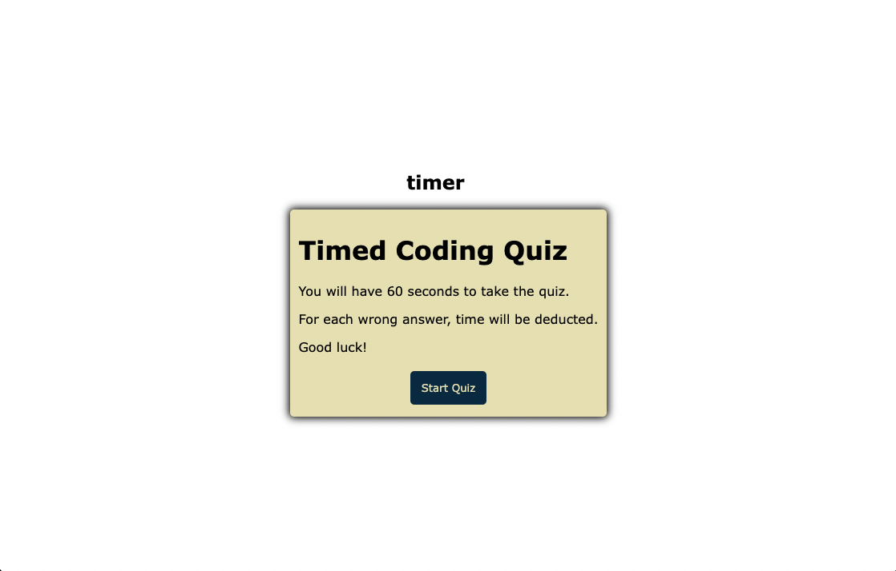

# Coding Quizola

## Description
This coding quiz was an assignment from coding bootcamp. 

A user is presented with three JavaScript questions. If an incorrect answer is chosen, ten seconds is deducted from the clock. 

I found this assignment to be very challenging and despite a lot of effort and tutoring, I was not able to code the functionality that this application required to meet acceptance criteria. I was able to get the questions and answers to display, and was able to include a timer, however the score is not stored and there is no log for user's initials. I hope that I am able to return and finish this at a later date.

## Installation
This web app runs on most browsers. You can visit the deployed link here: https://steviemiller.github.io/coding-quizola/

## Screenshots

